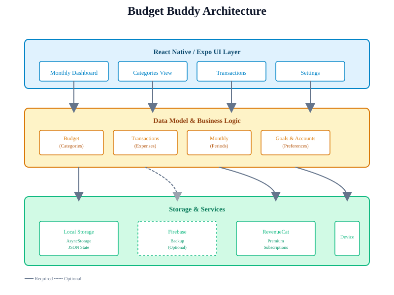
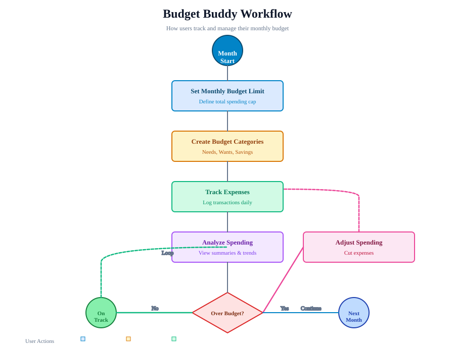

# Budget Buddy (Mobile App)

Budget Buddy is a simple Expo React Native app to help users track monthly budgets by category.

## App identity

- App name: `Budget Buddy`
- Expo slug: `budget-buddy`
- Expo owner: `rahul0083.be`
- iOS bundle ID: `com.rahulkumar.budgetbuddy`
- Android package: `com.rahulkumar.budgetbuddy`
- URL scheme: `budgetbuddy`

## Features

- Set a monthly budget limit per category
- Add, edit and remove expense entries
- Add expenses from inside a category with amount, description, date, and optional subcategory
- View planned, spent, and remaining totals per category
- Monthly summary and simple charts
- Optional Firebase backup and authentication

## Expense-entry design

Expense entry uses a compact, amount-first flow designed for quick mobile use. The amount is the only prominent card, while description, date, and advanced options use open rows with subtle dividers instead of nested boxes. Date is always visible, subcategories appear when available, and account or repeat settings remain under **More options**. Opening the form from a category keeps that category selected; opening it from a subcategory selects both automatically.

## Architecture

### App Structure



The app is built in three layers:
- **UI**: React Native components (Dashboard, Categories, Transactions, Settings)
- **Data**: Business logic and state management (Budgets, Transactions, Months)
- **Storage**: Local AsyncStorage, optional Firebase backup, and RevenueCat subscriptions

### Budget Workflow



Users follow this monthly cycle:
1. Set a budget limit for the month
2. Create budget categories (Needs, Wants, Savings)
3. Log daily expenses
4. Review spending patterns
5. Adjust if overspending
6. Roll over to next month

See the [UI and brand redesign record](./docs/UI_REDESIGN.md) and [architecture diagrams](./docs/DIAGRAMS.md) for more details.

## Getting started

Prerequisites:

- Node.js 18+ and npm
- Expo CLI (optional but recommended): `npm install -g expo-cli`

Install dependencies:

```bash
npm install
```

2. Start Expo:

   ```bash
   npm run start
   ```

3. Open on iOS/Android simulator or the Expo Go app.

## Type checking

```bash
npm run typecheck
```

## Local release checks

```bash
npx expo-doctor
npx expo export --platform ios --output-dir .expo-export-ios-check
rm -rf .expo-export-ios-check
```

## Account and backup

- The app is local-first by default.
- Firebase backup is optional and should be enabled only when the user wants reinstall or cross-device recovery.
- Email/password login lives in Firebase Auth.
- Firebase backup is a Premium feature and only runs when the user is signed in and backup is turned on.

## Premium setup

Budget Buddy uses RevenueCat for iOS subscriptions.

- Entitlement: `premium`
- Products:
  - `premium_monthly`
  - `premium_yearly`
- Public iOS SDK key env var:
  - `EXPO_PUBLIC_REVENUECAT_IOS_API_KEY`
- Public Android SDK key env var, if Android subscriptions are enabled:
  - `EXPO_PUBLIC_REVENUECAT_ANDROID_API_KEY`

Local example:

Or create a local `.env` from [.env.example](./.env.example), then restart Expo with a clean cache:

```bash
cp .env.example .env
npx expo start --clear
```

RevenueCat purchases require a development build, TestFlight/App Store build, or Android build with native IAP support. Expo Go cannot complete native in-app purchases.

For EAS production builds, add the same env vars in EAS secrets or environment settings before building. The app includes a RevenueCat test key for development fallback only; production builds should use real app-specific SDK keys.

## Scripts

- `npm start` — Start the Expo development server
- `npm run android` — Run on Android emulator/device (if configured)
- `npm run ios` — Run on iOS simulator (macOS only)
- `npm run typecheck` — Run TypeScript type checks (if project uses TypeScript)

## Configuration

If using Firebase for optional backup and authentication, set these environment variables locally or in your build environment:

- `FIREBASE_API_KEY`
- `FIREBASE_AUTH_DOMAIN`
- `FIREBASE_PROJECT_ID`
- `FIREBASE_STORAGE_BUCKET`
- `FIREBASE_MESSAGING_SENDER_ID`
- `FIREBASE_APP_ID`

For RevenueCat (iOS subscriptions) set:

- `EXPO_PUBLIC_REVENUECAT_IOS_API_KEY`

Local example (start with a public RevenueCat key):

```bash
EXPO_PUBLIC_REVENUECAT_IOS_API_KEY=appl_your_public_sdk_key npm start
```

## iOS release (example)

```bash
npm run build:ios
npm run submit:ios
```

Before submitting to the App Store, ensure:

- App Store Connect app created
- RevenueCat products and entitlements configured
- App icons and screenshots prepared
- Privacy/support URLs and App Store privacy details provided

## Contributing

- [APP_STORE_METADATA.md](./APP_STORE_METADATA.md)
- [PRIVACY.md](./PRIVACY.md)
- [SUPPORT.md](./SUPPORT.md)

Contributions, bug reports and feature requests are welcome. Please open an issue or submit a PR.

## License

This project is provided under the MIT License. See LICENSE for details.
